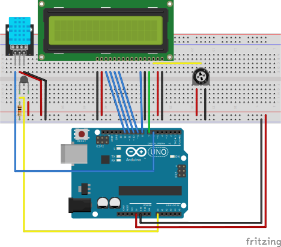

# Thermometer — LCD Display

100k NTC thermistor + DHT11 with a 16x2 LCD display on an Arduino MEGA 2560. Shows temperature on the top row and humidity + raw ADC on the bottom row.

## Sensors

- **100k NTC Thermistor** on A0 -- temperature via Beta equation (B=3950, 10k series resistor)
- **DHT11** on D6 -- humidity

## LCD Wiring (4-bit mode)

| LCD Pin | MEGA Pin |
|---------|----------|
| RS      | D7       |
| E       | D8       |
| D4      | D9       |
| D5      | D10      |
| D6      | D11      |
| D7      | D12      |

## Wiring Diagram

## Libraries

- LiquidCrystal
- Adafruit DHT sensor library
