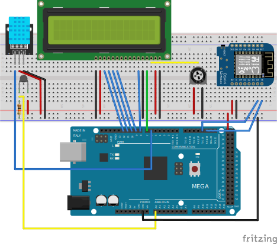

# WiFi Thermometer

Arduino MEGA 2560 project that reads temperature (NTC thermistor + DHT11) and humidity, displays values on a 16x2 LCD, and sends them as JSON to a webhook via an ESP8266 WiFi module.

## Sensors

- **100k NTC Thermistor** on A0 -- temperature via Beta equation (B=3950, 10k series resistor)
- **DHT11** on D6 -- temperature + humidity

## Display

16x2 LCD in 4-bit mode on pins 7, 8, 9, 10, 11, 12.

## WiFi

ESP8266 on Serial1 (TX1/RX1, pins 18/19) at 115200 baud. Supports both WPA2-PSK and WPA2-Enterprise via auto-detection. Data is POSTed as JSON to `webhook.site`.

## Wiring

## Libraries

- LiquidCrystal
- Adafruit DHT sensor library
- ArduinoJson
