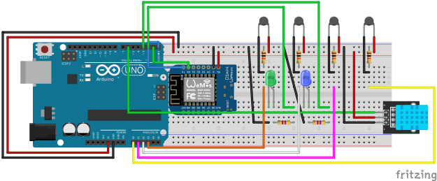
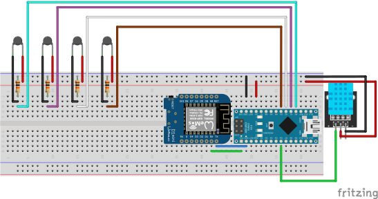

# Screenless WiFi Thermometer

Screenless Arduino project that reads several NTC thermistors plus a DHT11 humidity sensor and POSTs the readings as JSON to a remote API over an ESP8266 WiFi module. Two LEDs give physical feedback (no LCD): one solid when WiFi is connected, one that blinks on each POST.

Two variants are provided, identical in logic but differing in how the ESP8266 is wired to the board:

| Variant | Folder | ESP link | Baud | Board target |
|---------|--------|----------|------|--------------|
| **A** | `thermometer_wifi_screenless_A/` | `SoftwareSerial` on pins 10 (RX) / 11 (TX) | 9600 | Arduino Uno (no spare hardware UART) |
| **E** | `thermometer_wifi_screenless_E/` | hardware `Serial1` (pins 18/19) | 115200 | Arduino MEGA 2560 |

The two sketches also tag their payloads with a different `room` field (`"A"` and `"E"`) so the API can tell the rooms apart.

> ⚠️ **The WiFi SSID and password in the sketches are old credentials that no longer work.** Update `SSID` and `PASSWORD` (near the top of each `.ino`) to your own network before flashing, otherwise the board will keep reporting `WiFi FAILED!` and skip every POST.

## Sensors

- **Up to 4x 100k NTC Thermistors** on A0–A3 — temperature via the Beta equation (B=3950, 10kΩ series resistor each). Add/remove pins in the `THERM_PINS[]` array.
- **DHT11** on D6 — humidity.

Per-thermistor wiring: `5V -> thermistor -> Ax -> 10kΩ -> GND`.

## LEDs

- **D2** — solid ON while WiFi is connected.
- **D3** — blinks for ~1.5s on each successful POST.

## WiFi & API

ESP8266 driven with raw AT commands. Readings are POSTed roughly once a minute as JSON to `http://activesaip.thomasbechu.me/temperatures`:

```json
{ "room": "A", "temperatures": [21.3, 22.0, ...], "humidity": 45.0 }
```

## Wiring

- Variant A: 
- Variant E: 

Fritzing source files (`.fzz`) are included alongside each diagram.

## Libraries

- Adafruit DHT sensor library
- ArduinoJson
- SoftwareSerial (variant A only, bundled with the Arduino core)
